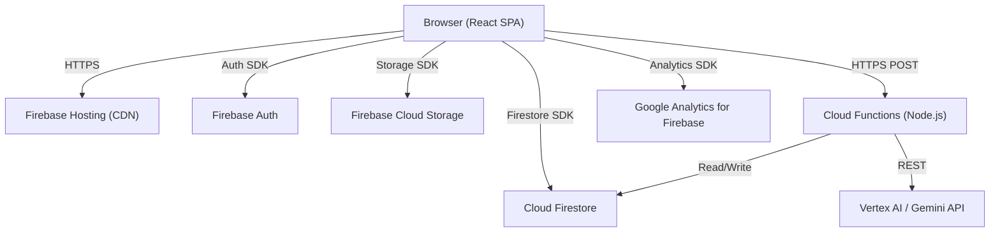
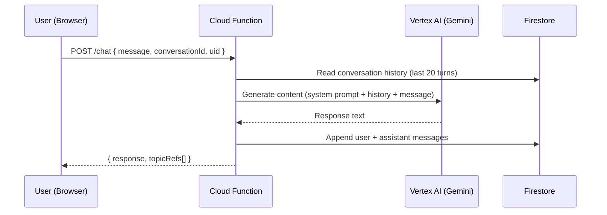

# Design Document: Election Process Education Assistant

## Overview

Civic Clarity is a non-partisan, AI-powered election education web application. It helps citizens understand voter registration, election timelines, ballot processes, and civic participation through a conversational AI assistant, structured content modules, and an interactive election timeline.

The application is a React 18 + TypeScript SPA hosted on Firebase Hosting, backed by Cloud Firestore, Firebase Auth, Firebase Cloud Storage, Google Analytics for Firebase, and Vertex AI (Gemini) via Cloud Functions. The "Civic Clarity" design system (Public Sans + Lexend typography, #002e68 primary blue, #006d3a secondary green) is implemented with Tailwind CSS custom tokens.

### Key Design Goals

- Non-partisan, institutionally authoritative tone with inclusive warmth
- Accessible to all users (WCAG 2.1 AA), including keyboard-only and screen-reader users
- Fast initial load (LCP ≤ 2.5s), offline-resilient via Firestore persistence
- Secure by default: HTTPS everywhere, Firestore rules scoped to UID, CSP headers
- Modular, testable codebase with ≥80% unit test coverage

---

## Architecture

### High-Level Architecture



### Request Flow: AI Chat



### Tech Stack

| Layer | Technology |
|---|---|
| Frontend | React 18, TypeScript, Vite |
| Styling | Tailwind CSS (Civic Clarity tokens) |
| Routing | React Router v6 |
| State | React Context + useReducer |
| Auth | Firebase Authentication |
| Database | Cloud Firestore |
| File Storage | Firebase Cloud Storage |
| Hosting | Firebase Hosting |
| AI Backend | Vertex AI Gemini via Cloud Functions |
| Analytics | Google Analytics for Firebase |
| Testing | Vitest, React Testing Library, Playwright, fast-check |
| CI/CD | GitHub Actions → Firebase Hosting |

---

## Components and Interfaces

### Component Hierarchy

```
App
├── AppShell
│   ├── NavBar
│   │   ├── Logo
│   │   ├── NavLinks (Topics, Timeline)
│   │   └── AuthControls (SignIn / UserBadge)
│   └── Footer
│       ├── FooterLinks (Accessibility, Privacy, Contact)
│       └── LanguageSelector
│
├── Pages (React.lazy, code-split per route)
│   ├── LandingPage
│   │   ├── HeroSection
│   │   ├── StatsBar
│   │   ├── FeatureBentoCards
│   │   └── CtaSection
│   │
│   ├── AuthPage
│   │   ├── BenefitsList
│   │   └── AuthForm
│   │       ├── GoogleOAuthButton
│   │       ├── EmailPasswordForm
│   │       ├── ErrorBanner
│   │       └── GuestButton
│   │
│   ├── DashboardPage
│   │   ├── DashboardSidebar
│   │   │   ├── UserProfile
│   │   │   ├── SidebarNav
│   │   │   └── DidYouKnowCard
│   │   └── DashboardMain
│   │       ├── WelcomeHeader
│   │       ├── ProgressCard (ProgressRing + StreakGrid)
│   │       ├── StatsCards
│   │       ├── ContinueLearning (ModuleCard[])
│   │       └── RecentActivity (ActivityFeed + BadgeRow)
│   │
│   ├── ChatPage
│   │   ├── ChatHistory (role="log", aria-live="polite")
│   │   │   ├── DateDivider
│   │   │   ├── MessageBubble (assistant | user)
│   │   │   ├── FactSheetCard
│   │   │   └── TypingIndicator
│   │   └── ChatInputArea
│   │       ├── SuggestedChips
│   │       └── MessageInput (textarea + CharCounter + SendButton)
│   │
│   └── TimelinePage
│       ├── TimelinePageHeader
│       ├── AlertBanner
│       ├── LegendFilterBar
│       ├── TimelineVisualizer (horizontal scroll)
│       │   ├── TimelineTrack (dashed line)
│       │   ├── TodayMarker
│       │   └── TimelineNode[] (circle | pill | square)
│       ├── TimelineListView (3-col cards)
│       └── FactSheetSection
```

### Key Shared Components

#### `NavBar`
- Sticky, `z-50`, `bg-white/95 backdrop-blur-sm`
- Logo: "CIVIC CLARITY" uppercase, `text-[#004492]`, `font-bold`
- Active link: `border-b-2 border-[#004492]`
- Auth state: shows "Sign In" + "Get Started" (unauthenticated) or user badge chip (authenticated)

#### `MessageBubble`
```typescript
interface MessageBubbleProps {
  role: 'assistant' | 'user';
  content: string;
  timestamp: Date;
  topicRefs?: string[];
}
```
- Assistant: left-aligned, blue avatar (`smart_toy` icon), `bg-surface-container-low`, `rounded-xl rounded-tl-none`
- User: right-aligned, green avatar (`person` icon), `bg-primary-container text-white`, `rounded-xl rounded-tr-none`

#### `FactSheetCard`
```typescript
interface FactSheetCardProps {
  title: string;
  body: string;
  actionLabel: string;
  actionUrl: string;
  icon: string; // Material Symbol name
}
```
- White card, `border-l-4 border-[#004492]`, action buttons (primary filled + secondary outlined)

#### `TimelineNode`
```typescript
interface TimelineNodeProps {
  event: TimelineEvent;
  isToday: boolean;
  isPast: boolean;
}
// Shape: circle (registration/deadline), pill (period), square (election day)
```

#### `ProgressRing`
```typescript
interface ProgressRingProps {
  percent: number; // 0–100
  size?: number;   // SVG diameter, default 128
}
```
- SVG circle with `stroke-dashoffset` calculated from percent
- Circumference = 2π × r (r = 58 for default size)

#### `AlertBanner`
```typescript
interface AlertBannerProps {
  variant: 'warning' | 'error' | 'info';
  title: string;
  body: string;
}
```
- Warning: `bg-[#FFF9E6] border-l-4 border-amber-500`
- Error: `bg-error-container border-l-4 border-error`

### Custom Hooks

| Hook | Purpose |
|---|---|
| `useAuth()` | Firebase Auth state, sign-in/out methods |
| `useProgress(uid)` | Read/write topic completion from Firestore |
| `useConversation(uid)` | Manage chat messages, call Cloud Function |
| `useTimeline(cycleId)` | Fetch timeline events from Firestore |
| `useTopics(locale)` | Fetch topic library, search |

---

## Data Models

### Firestore Collections

#### `users/{uid}`
```typescript
interface UserDocument {
  displayName: string;
  email: string | null;
  locale: 'en' | 'es';
  progress: {
    [topicId: string]: {
      completed: boolean;
      completedAt: Timestamp | null;
    };
  };
  badgesEarned: string[];       // badge IDs
  questionsAsked: number;
  topicsViewed: number;
  createdAt: Timestamp;
  lastActiveAt: Timestamp;
}
```

#### `topics/{topicId}`
```typescript
interface TopicDocument {
  title: string;
  slug: string;
  category: 'registration' | 'ballot' | 'polling' | 'electoral-college'
           | 'absentee' | 'security' | 'candidates' | 'finance'
           | 'certification' | 'civic-rights';
  contentMd: string;            // Markdown body
  mediaRefs: string[];          // Storage URLs
  locale: 'en' | 'es';
  readingTimeMinutes: number;
  createdAt: Timestamp;
  updatedAt: Timestamp;
}
```

Schema validation is enforced in the Cloud Function before any write to `topics/`.

#### `timelines/{cycleId}`
```typescript
interface TimelineDocument {
  year: number;
  label: string;                // e.g. "2024 Election Cycle"
  events: TimelineEvent[];
}

interface TimelineEvent {
  id: string;
  date: string;                 // ISO 8601 date or date range "YYYY-MM-DD/YYYY-MM-DD"
  phase: 'registration' | 'primary' | 'general' | 'certification';
  title: string;
  description: string;
  type: 'deadline' | 'period' | 'election-day' | 'milestone';
  urgent?: boolean;
  actionUrl?: string;
}
```

#### `conversations/{uid}/messages/{msgId}`
```typescript
interface MessageDocument {
  role: 'user' | 'assistant';
  content: string;
  timestamp: Timestamp;
  topicRefs: string[];          // topicId references surfaced by AI
}
```

### Firestore Security Rules (summary)

```
rules_version = '2';
service cloud.firestore {
  match /databases/{database}/documents {
    // Users can only access their own document
    match /users/{uid} {
      allow read, write: if request.auth != null && request.auth.uid == uid;
    }
    // Topics are public read, admin write only
    match /topics/{topicId} {
      allow read: if true;
      allow write: if false; // managed via Cloud Functions with service account
    }
    // Timelines are public read
    match /timelines/{cycleId} {
      allow read: if true;
      allow write: if false;
    }
    // Conversations scoped to owner
    match /conversations/{uid}/messages/{msgId} {
      allow read, write: if request.auth != null && request.auth.uid == uid;
    }
  }
}
```

### Content Serialization Format

Topic `contentMd` is stored as Markdown. The `ContentService` parses it to a `ContentNode[]` AST for rendering and re-serializes it for caching. The round-trip property (parse → serialize → parse) must produce an equivalent AST — this is the basis for Property 1 in the Correctness Properties section.

```typescript
type ContentNode =
  | { type: 'heading'; level: 1 | 2 | 3; text: string }
  | { type: 'paragraph'; text: string }
  | { type: 'list'; ordered: boolean; items: string[] }
  | { type: 'image'; src: string; alt: string }
  | { type: 'factsheet'; title: string; body: string; actionLabel: string; actionUrl: string };
```

---

## Page-by-Page UI Design

### Landing Page (`/`)

Implements `stitch_landing_page`. Public, no auth required.

**Layout:**
- Sticky `NavBar` (unauthenticated state: "Sign In" + "Get Started" buttons)
- Hero: 2-col grid (`md:grid-cols-2`). Left: badge chip, h1, body, two CTAs. Right: hero image with decorative circle (`bg-surface-container-high rounded-full opacity-50`)
- Stats bar: 3-col, `bg-surface-container-low`, center-aligned numbers in `text-h2 text-primary`
- Feature bento: 12-col grid. 7-col AI card (`border-l-4 border-primary`), 5-col Progress card (`border-l-4 border-secondary`), 12-col Timeline card
- CTA section: `bg-primary text-on-primary`, centered, two buttons (white filled + outlined)
- `Footer` with language selector

**Interactions:**
- "Get Started" → `/auth`
- "Watch How It Works" → modal or `/topics` (TBD)
- "Topics" nav link → `/topics`
- "Timeline" nav link → `/timeline`

---

### Auth Page (`/auth`)

Implements `stitch_signup_page`. Centered card layout, dotted grid background (`election-bg` radial-gradient pattern).

**Layout:**
- `NavBar` (minimal — logo + nav links only, no auth buttons)
- Centered `max-w-[1000px]` 2-col card:
  - Left panel (hidden mobile): benefits list (Track Progress, Verified Sources, Smart Alerts), security note
  - Right panel: Google OAuth button, "or use email" divider, email + password fields with always-visible `label-caps` labels, Sign In button, loading state, "Continue as Guest" button, "Register Now" link
- Error state: `bg-error-container text-on-error-container` banner with `error` icon

**Auth Flows:**
1. Google OAuth → `signInWithPopup(googleProvider)` → redirect to `/dashboard`
2. Email/password → `signInWithEmailAndPassword` → redirect to `/dashboard`
3. Guest → `signInAnonymously` → redirect to `/dashboard` (limited features)
4. Register → `/register` (separate page, same card layout)

**Error Handling:**
- `auth/wrong-password`, `auth/user-not-found` → show error banner
- Network error → show error banner with retry option
- Loading state: spinner button replaces Sign In button during auth

---

### Dashboard (`/dashboard`)

Implements `stitch_dashboard`. Requires authentication (redirect to `/auth` if unauthenticated).

**Layout:**
- `NavBar` with "Gold Voter" badge chip (user's earned tier)
- 2-col: `DashboardSidebar` (w-64, sticky top-24) + `DashboardMain` (flex-grow)

**Sidebar:**
- User avatar + name + "Verified Voter" label
- Nav links: Dashboard (active: `border-l-4 border-[#004492] bg-surface-container-low`), My Modules, Election Dates, Preferences
- "Did You Know?" info card (`border-l-4 border-primary bg-on-primary-container/10`)

**Main Content:**
- Welcome header: "Welcome back, [displayName]" + current date + action buttons
- Progress card (8-col): `ProgressRing` (SVG, percent from `userProgress`), weekly streak counter, 7-day activity grid (green squares for active days)
- Stats cards (4-col, 2-row): Topics Viewed (`bg-primary-container`), Questions Asked (`bg-secondary`)
- Continue Learning (7-col): `ModuleCard[]` with image, progress bar, module badge
- Recent Activity (5-col): activity feed + `BadgeRow`

**Data Loading:**
- `useProgress(uid)` → populates ProgressRing and stats
- `useTopics(locale)` → populates Continue Learning modules
- Activity feed from `conversations/{uid}/messages` (last 5 events)

---

### Chat Page (`/chat`)

Implements `stitch_chat_interface_page`. Full-height layout (`h-screen overflow-hidden`).

**Layout:**
- `NavBar` + "Start New Conversation" button (top-right)
- `ChatHistory`: `flex-grow overflow-y-auto`, `role="log" aria-live="polite" aria-label="Conversation history"`
  - Date divider chip (`bg-surface-container-low rounded-full`)
  - `MessageBubble` components (assistant left, user right)
  - `FactSheetCard` inline within assistant messages
  - `TypingIndicator` (3 bouncing dots, shown while awaiting AI response)
- `ChatInputArea` (sticky bottom):
  - `SuggestedChips` (3 pill buttons, pre-populated from topic context)
  - `MessageInput`: auto-resize textarea, character counter (0/500), send button
  - Disclaimer: "Official Non-Partisan AI Assistant"

**Conversation Flow:**
1. User types or selects a suggested chip
2. User message appended to `ChatHistory` immediately (optimistic update)
3. `TypingIndicator` shown within 300ms
4. `useConversation` calls Cloud Function `/chat`
5. Cloud Function reads last 20 messages, calls Gemini, writes both messages to Firestore
6. Response rendered as `MessageBubble` + optional `FactSheetCard`
7. ARIA live region announces new assistant message to screen readers

**Input Constraints:**
- Max 500 characters (enforced client-side + server-side)
- Empty/whitespace-only input: send button disabled
- Input sanitized (strip HTML tags) before sending to Cloud Function

---

### Timeline Page (`/timeline`)

Implements `stitch_election_timeline_page`. Public, no auth required.

**Layout:**
- `NavBar` (Timeline link active: `border-b-2 border-[#004492]`)
- Page header: "2024 ELECTION CYCLE" label-caps, h1 "Election Roadmap", description, Print + Get Alerts buttons
- `AlertBanner` (warning variant, amber) for urgent deadlines
- `LegendFilterBar`: colored dot legend + List/Grid toggle
- `TimelineVisualizer`: horizontally scrollable (`overflow-x-auto`), `min-w-[1400px]`
  - Dashed base line (CSS `background-image` linear-gradient trick)
  - "TODAY" vertical marker (absolute positioned, `left` calculated from today's date relative to cycle start/end)
  - `TimelineNode[]`: circle (registration/deadline), pill (period), square (election day)
  - Hover tooltips: `opacity-0 group-hover:opacity-100`, white card with details + action link
- `TimelineListView`: 3-col cards (Registration, Primaries, General Election), each with colored header + left-border-coded entries
- `FactSheetSection`: 2-col — "How to use this timeline" (blue left-border) + "Language Options" (green left-border)

**Real-time Updates:**
- `useTimeline(cycleId)` uses Firestore `onSnapshot` listener
- Updates reflected within 60 seconds (Firestore real-time propagation)
- "TODAY" marker recalculated on mount and on date change (midnight)

**Print Support:**
- `@media print` CSS: hide `.no-print` elements (nav, filter bar, buttons)
- Timeline list view is print-friendly (no horizontal scroll)

---

## Google Services Integration

### 1. Firebase Authentication

- SDK: `firebase/auth`
- Providers: `GoogleAuthProvider`, `EmailAuthProvider`, `signInAnonymously`
- Session persistence: `browserLocalPersistence` (default)
- Token refresh: handled automatically by Firebase SDK
- Anonymous → permanent account merge: `linkWithCredential(currentUser, credential)`
- Auth state propagated via `AuthContext` (React Context)

### 2. Cloud Firestore

- SDK: `firebase/firestore`
- Offline persistence: `enableIndexedDbPersistence(db)` — enables local cache for progress data
- Real-time listeners: `onSnapshot` for timeline and conversation updates
- Batch writes: used when recording topic completion + analytics event atomically
- Indexes: composite index on `topics` collection for `(category, locale)` queries

### 3. Firebase Hosting

- SPA rewrite: all routes → `/index.html`
- CDN caching: static assets (`/assets/**`) cached with `Cache-Control: max-age=31536000, immutable`
- CSP headers configured in `firebase.json`:
  ```json
  "headers": [{
    "source": "**",
    "headers": [{
      "key": "Content-Security-Policy",
      "value": "default-src 'self'; script-src 'self' https://cdn.tailwindcss.com; connect-src 'self' https://*.googleapis.com https://*.firebaseio.com; img-src 'self' data: https://lh3.googleusercontent.com; font-src 'self' https://fonts.gstatic.com;"
    }]
  }]
  ```

### 4. Firebase Cloud Storage

- SDK: `firebase/storage`
- Media assets (images, PDFs, infographics) stored under `gs://civic-clarity.appspot.com/topics/{topicId}/`
- Served via CDN-backed HTTPS URLs
- Storage security rules: public read for `topics/**`, authenticated write only
- Images lazy-loaded with `loading="lazy"` attribute

### 5. Google Analytics for Firebase

- SDK: `firebase/analytics`
- Custom events:
  - `session_start` — on auth state change to signed-in
  - `topic_complete` — `{ topic_id: string }`
  - `question_asked` — `{ query_category_hash: string }` (SHA-256 of category, not raw text)
  - `service_error` — `{ error_type: string, service_name: string }`
- PII policy: raw query text is never logged; only hashed category identifiers

### 6. Vertex AI (Gemini) via Cloud Functions

- Cloud Function: `onRequest` HTTP function, authenticated via Firebase ID token verification
- Model: `gemini-1.5-flash` (balance of speed and quality)
- System prompt: non-partisan election education context, plain language instruction, 10th-grade reading level
- Context window: last 20 conversation turns passed as `contents[]`
- Input sanitization: strip HTML tags, truncate to 500 chars before forwarding
- Response timeout: 10s Cloud Function timeout; client shows error after 5s
- Error handling: Gemini errors caught, logged to Analytics, fallback message returned to client

---

## Security Design

### Authentication & Authorization

- All Firestore reads/writes for user data require `request.auth.uid == uid`
- Cloud Functions verify Firebase ID token via `admin.auth().verifyIdToken()`
- Anonymous users can read public content (topics, timelines) but cannot write to `users/` or `conversations/`

### Input Sanitization

```typescript
// Applied in Cloud Function before forwarding to Vertex AI
function sanitizeInput(raw: string): string {
  return raw
    .replace(/<[^>]*>/g, '')      // strip HTML tags
    .replace(/[^\w\s.,?!'-]/g, '') // allow only safe characters
    .trim()
    .slice(0, 500);               // enforce max length
}
```

### Content Security Policy

CSP headers applied via Firebase Hosting configuration (see Google Services section). Prevents XSS by restricting script sources.

### Data Minimization

- Only `displayName`, `email`, `locale`, `progress`, `badgesEarned` stored per user
- No raw query text stored in Analytics
- Conversation messages stored only in user's own Firestore subcollection

### Session Management

- Firebase SDK handles token refresh automatically (every ~1 hour)
- Expired/invalid tokens: Firestore security rules reject the request; client `onAuthStateChanged` listener redirects to `/auth`

---

## Performance Strategy

### Code Splitting

All page components loaded with `React.lazy` + `Suspense`:
```typescript
const DashboardPage = React.lazy(() => import('./pages/DashboardPage'));
const ChatPage = React.lazy(() => import('./pages/ChatPage'));
const TimelinePage = React.lazy(() => import('./pages/TimelinePage'));
```

### Asset Loading

- Images: `loading="lazy"` on all `` tags below the fold
- Fonts: `display=swap` on Google Fonts URL
- Hero image: `fetchpriority="high"` (above the fold)

### Caching Strategy

- Static assets: `Cache-Control: max-age=31536000, immutable` (Vite content-hashed filenames)
- Topic content: Firebase Hosting CDN caches `/api/topics/**` responses
- Firestore offline persistence: `enableIndexedDbPersistence` for progress data

### Bundle Optimization

- Vite tree-shaking removes unused Firebase SDK modules
- Only import used Firebase services: `import { getFirestore } from 'firebase/firestore'`
- Tailwind CSS purged in production build

### Core Web Vitals Targets

| Metric | Target |
|---|---|
| LCP | ≤ 2.5s |
| CLS | ≤ 0.1 |
| Loading indicator | ≤ 300ms after question submit |

---

## Accessibility Implementation

### ARIA Structure

- `NavBar`: `<nav aria-label="Main navigation">`
- `ChatHistory`: `<div role="log" aria-live="polite" aria-label="Conversation history">`
- `TypingIndicator`: `<div aria-label="Assistant is typing" aria-live="polite">`
- `ProgressRing`: `<svg aria-label="Learning progress: 70% complete" role="img">`
- `TimelineNode`: `<button aria-label="{event.title} - {event.date}" aria-expanded="false">`
- All icon-only buttons: `aria-label` describing the action
- `AlertBanner`: `role="alert"` for urgent messages

### Keyboard Navigation

- All interactive elements reachable via Tab
- Focus order follows visual reading order (left-to-right, top-to-bottom)
- `focus-visible` ring: `outline: 2px solid #004492; outline-offset: 2px`
- Modal/tooltip: focus trapped inside while open, returns to trigger on close
- Timeline horizontal scroll: keyboard-navigable via arrow keys on the scroll container

### Color Contrast

- Primary text on white: `#191c1d` on `#ffffff` → 16.1:1 ✓
- Primary blue on white: `#002e68` on `#ffffff` → 14.7:1 ✓
- Body text on surface-container-low: `#191c1d` on `#f3f4f5` → 15.8:1 ✓
- White on primary-container: `#ffffff` on `#004492` → 7.2:1 ✓
- All ratios exceed 4.5:1 minimum for normal text

### Non-Color State Indicators

- Active nav link: underline + color (not color alone)
- Error state: icon + text + color
- Progress: percentage text + visual ring (not color alone)
- Timeline event types: shape + color + label

### Screen Reader Support

- `aria-live="polite"` on chat history for new assistant messages
- `alt` text on all images (descriptive, not "image of...")
- PDF/infographic links include `aria-label` with document description
- Language selector: `<select aria-label="Select language">`

---

## Testing Strategy

### Unit Tests (Vitest + React Testing Library)

Target: ≥80% coverage for all business logic modules.

Focus areas:
- `ContentService`: Markdown parsing, serialization, schema validation
- `sanitizeInput`: injection prevention
- `useProgress`: progress calculation, completion detection
- `ProgressRing`: SVG stroke-dashoffset calculation
- `TimelineVisualizer`: TODAY marker position calculation
- `MessageBubble`: rendering for both roles
- Auth flows: sign-in, sign-out, anonymous merge

### Integration Tests (Firebase Emulator Suite)

One test per Google service integration:
- Firebase Auth: sign-in flows, token refresh, anonymous merge
- Firestore: CRUD operations, security rules enforcement, offline sync
- Cloud Storage: upload, download, CDN URL generation
- Cloud Functions: `/chat` endpoint with mock Vertex AI response
- Analytics: event logging (mock `logEvent`)

### End-to-End Tests (Playwright)

Key user journeys:
1. Landing → Auth → Dashboard (authenticated flow)
2. Dashboard → Chat → ask question → receive response
3. Timeline page → hover event node → see tooltip
4. Guest flow: anonymous sign-in → view topics → progress not persisted

### Property-Based Tests (fast-check)

See Correctness Properties section below. Each property test runs minimum 100 iterations.

Tag format: `// Feature: election-process-education, Property {N}: {property_text}`

---
